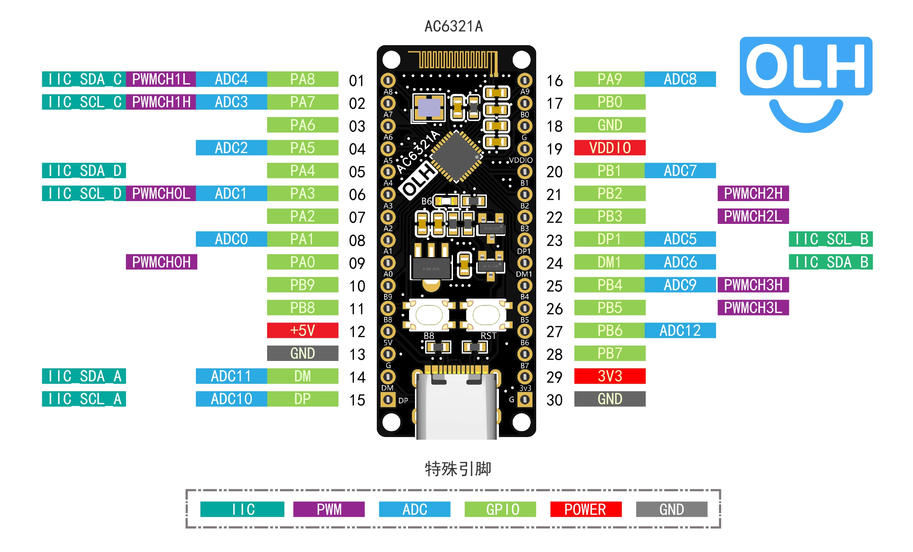
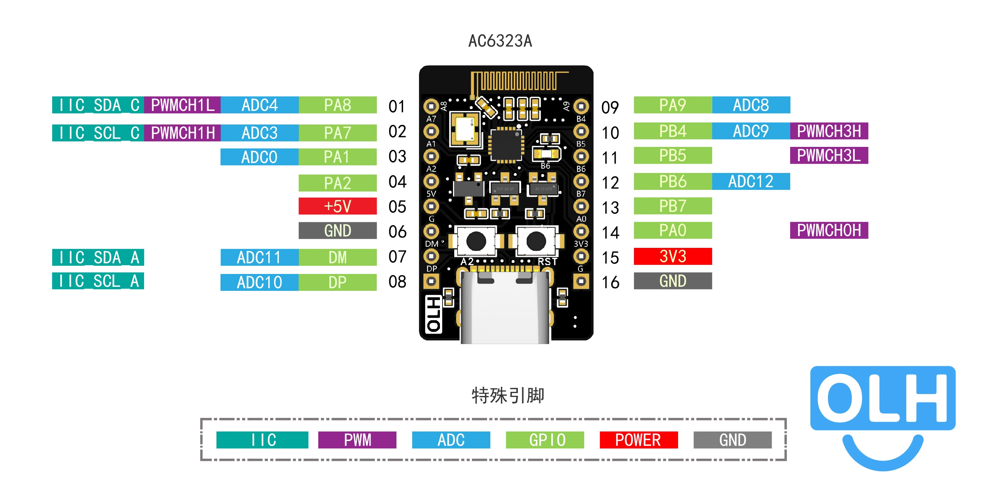

# 杰理AC632n测试程序

#### 介绍
- 启用spp_and_le dome
- 关闭部分功能，在配置头文件中
- 实现所有io定时反转
- 使用DP引脚打印输出日志


# [B站主页](https://space.bilibili.com/3546810423445874?spm_id_from=333.1387.fans.user_card.click)
# [杰理AC632N官方介绍](https://doc.zh-jieli.com/vue/#/docs/ac63)


## [杰理AC6321A购买连接](https://item.taobao.com/item.htm?ft=t&id=844438677259)


## [杰理AC6323A购买连接](https://item.taobao.com/item.htm?ft=t&id=844641938402)

## [杰理AC632N系列芯片开发环境快速搭建教程](https://www.bilibili.com/video/BV1LmqrYkEZo/?share_source=copy_web&vd_source=e72126e3b43c199d53df27684cb64c62)

## [杰理AC632n系列芯片的SDK基本介绍和程序烧录演示](https://www.bilibili.com/video/BV183XwYZELM/?share_source=copy_web&vd_source=e72126e3b43c199d53df27684cb64c62)


## 示例代码
 
  - uart-测试代码(apps\hid\src\user_uart\user_uart.c)
``` C

#include "user_uart.h"
#include "asm/gpio.h"
#include "asm/uart_dev.h" 
#include "asm/gpio.h"
#include "event.h"

#define UART_BUFFER_SIZE 256

static uart_bus_t *my_uart_bus;
static u8 uart_buffer[UART_BUFFER_SIZE];


#define MAX_CALLBACK_NUM 10

void (*uart_callback_fun[MAX_CALLBACK_NUM])(unsigned char *, unsigned char);

/// @brief 串口发送函数
/// @param buf
/// @param len
void user_uart_send(u8 *buf, u8 len)
{
    if (len > UART_BUFFER_SIZE)
    {
        printf("uart data buffer length too long");
        my_uart_bus->write(buf, 255);
        return;
    }
    put_buf(buf, len);
    my_uart_bus->write(buf, len);
}

/// @brief 串口接收回调函数，当接收到串口数据时，系统会调用此函数
/// @param ut_bus
/// @param status
static void uart_receive(void *ut_bus, u32 status)
{
    const uart_bus_t *ubus = ut_bus;
    u8 data[254] = {0};
    u16 len = 0;
    switch (status)
    {
    case UT_RX: // 接收到数据
        len = ubus->read(data, 254, 10);
        break;
    case UT_RX_OT: // 接收到数据超时
        len = ubus->read(data, 254, 10);
        break;
    default:
        return;
        break;
    }


    // 调用已注册的函数，并将数据传入
    for (int i = 0; i < MAX_CALLBACK_NUM; ++i)
    {
        if (uart_callback_fun[i] != NULL)
        {
            uart_callback_fun[i](data, len);
        }
    }
}

/// @brief 出口回调函数注册接口，注册回调函数，当有串口数据时就会调用被注册函数，并传入串口数据
/// @param callback
void uart_callback_register(void (*callback)(unsigned char *, unsigned short))
{
    for (int i = 0; i < MAX_CALLBACK_NUM; ++i)
    {
        if (uart_callback_fun[i] == NULL)
        {
            uart_callback_fun[i] = callback;
            printf("uart callback register ok => %d", i);
            return;
        }
    }
    printf("full uart callback list!");
}

/// @brief 串口初始化函数
/// @param baud
void user_uart_init(u32 baud)
{
    printf("uart_init");

    struct uart_platform_data_t u_arg = {0};
    u_arg.tx_pin = TX;
    u_arg.rx_pin = RX;
    u_arg.rx_cbuf = uart_buffer;
    u_arg.rx_cbuf_size = 256;
    u_arg.frame_length = 100;
    u_arg.rx_timeout = 20;
    u_arg.isr_cbfun = uart_receive;
    u_arg.baud = baud;
    u_arg.is_9bit = 0;
    my_uart_bus = uart_dev_open(&u_arg);
}
```


- 创建线程接口(include_lib\system\os\os_api.h)
``` C
/* --------------------------------------------------------------------------*/
/**
 * @brief 创建任务
 *
 * @param task 任务回调函数
 * @param p_arg 传递给任务回调函数的参数
 * @param prio 任务的优先级
 * @param stksize 任务的堆栈大小, 单位(u32)
 * @param qsize 任务的queue大小，单位(byte)
 * @param name 任务名 (名字长度不能超过configMAX_TASK_NAME_LEN字节)
 *
 * @return 错误码
 */
/* ----------------------------------------------------------------------------*/
int os_task_create(void (*task)(void *p_arg),
                   void *p_arg,
                   u8 prio,
                   u32 stksize,
                   int qsize,
                   const char *name);
```


